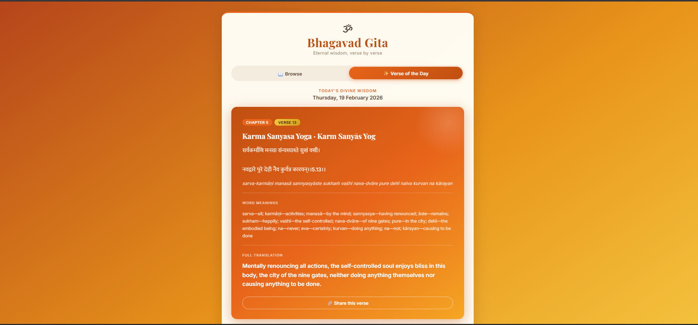

# 🕉 Divine Bhagavad Gita Viewer

[](https://bhagavad-gita-viewer.vercel.app/)
[](https://opensource.org/licenses/ISC)
[](#)

Explore the eternal wisdom of the **Bhagavad Gita** with this beautifully crafted web application. Designed for a serene and immersive reading experience, this viewer allows you to delve deep into the verses, understand their word-for-word meanings, and contemplate their full translations.

---

## ✨ Key Features

- **📖 Complete Browse Mode**: Navigate through all 18 chapters and their respective verses with ease.
- **✨ Verse of the Day**: Receive a daily dose of divine wisdom, picked deterministically based on the date.
- **🕉 Sanskrit & Transliteration**: Read the original Sanskrit verses alongside Roman transliteration.
- **📝 Word Meanings**: Breakdown of every verse into individual word meanings for deeper understanding.
- **📜 Full Translations**: Comprehensive English translations to help grasp the core message.
- **🎨 Premium Aesthetics**: A modern, responsive design with a spiritual saffron-gold theme, glassmorphism effects, and smooth animations.
- **🔗 Quick Share**: Share your favorite verses directly with friends or via social media.

---

## 🛠 Tech Stack

- **Frontend**: Vanilla HTML5, CSS3 (Rich Custom Variables), and Modern JavaScript (ES6+).
- **Backend/API**: Node.js Express serverless functions deployed on Vercel.
- **Upstream API**: [Bhagavad Gita API](https://rapidapi.com/bhagavad-gita3-bhagavad-gita3-default/api/bhagavad-gita3) via RapidAPI.
- **Deployment**: [Vercel](https://vercel.com).

---

## 🚀 Getting Started

### Prerequisites

- Node.js installed on your machine.
- A RapidAPI account for an API Key (if you wish to run the backend functions).

### Local Installation

1.  **Clone the repository**:
    ```bash
    git clone https://github.com/nsmenon95/bhagavad-gita-viewer.git
    cd bhagavad-gita-viewer
    ```

2.  **Install dependencies**:
    ```bash
    npm install
    ```

3.  **Environment Variables**:
    Create a `.env` file in the root directory and add your RapidAPI key:
    ```env
    API_KEY=your_rapidapi_key_here
    ```

4.  **Run with Vercel CLI** (recommended for testing serverless functions):
    ```bash
    vercel dev
    ```

---

## 📸 Preview

*The application features a responsive layout that adapts beautifully to both Desktop and Mobile devices.*

| Desktop View | Mobile View |
| :--- | :--- |
|  |  |

*(Note: Replace placeholders with actual screenshots after deployment)*

---

## 📜 Project Structure

```text
├── api/             # Vercel Serverless Functions
│   ├── chapter/     # Chapter-specific endpoints
│   ├── chapters.js  # Fetch all chapters
│   └── health.js    # API Health check
├── index.html       # Main application entry point
├── style.css        # Custom styles and design system
├── script.js        # Core application logic
├── vercel.json      # Vercel configuration & routing
└── package.json     # Node.js dependencies
```

---

## 🤝 Contributing

Contributions are what make the open-source community such an amazing place to learn, inspire, and create. Any contributions you make are **greatly appreciated**.

1. Fork the Project
2. Create your Feature Branch (`git checkout -b feature/AmazingFeature`)
3. Commit your Changes (`git commit -m 'Add some AmazingFeature'`)
4. Push to the Branch (`git push origin feature/AmazingFeature`)
5. Open a Pull Request

---

## 📄 License

Distributed under the **ISC License**. See `LICENSE` for more information.

---

<p align="center">
  <i>"Perform your obligatory duty, for action is better than inaction." — Bhagavad Gita 3.8</i>
</p>
